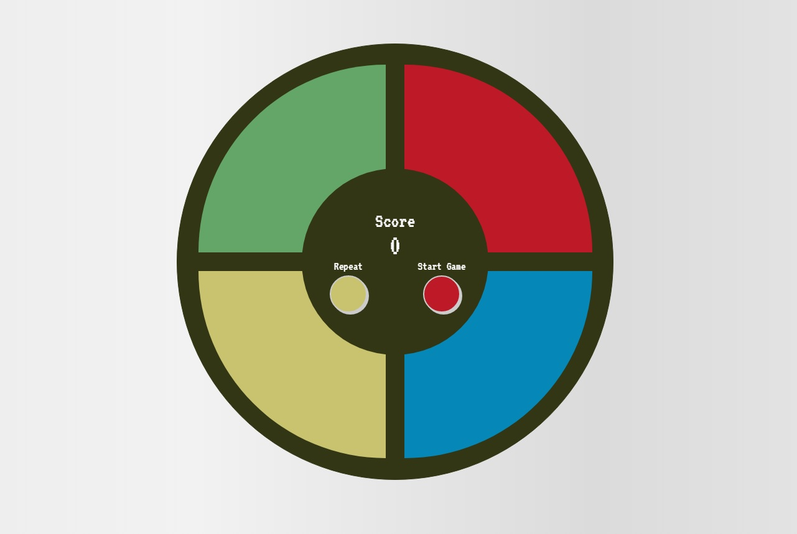

<h1 align="center">
  Genius
</h1>

<h4 align="center">Status: ✔ Concluído</h4>

<div align="center">
  
</div>

---

<p align="center">
 <a href="#user-content-sobre-o-projeto">Sobre o projeto</a> |
 <a href="#user-content-adicionais">Adicionais</a> |
 <a href="#user-content-executando-o-projeto">Executando o projeto</a> |
 <a href="#user-content-tecnologias">Tecnologias</a>
</p>

---

## **Sobre o projeto**

Jogo Genius desenvolvido com HTML, CSS(Grid) e JavaScript no bootcamp [Eduzz Fullstack Developer](https://digitalinnovation.one/bootcamps/eduzz-fullstack-developer) com a [Digital Innovation One](https://digitalinnovation.one/) e a [Gabriela Pinheiro](https://www.linkedin.com/in/gabrielapinheiro129/). [Link para o repositório original.](https://github.com/SpruceGabriela/genesis-dio)

## **Adicionais**
Nesta versão foi acrescentado:

- Migrado o código em JavaScript para TypeScript;
- Efeito de iluminação dos botões das cores;
- Botão para iniciar o jogo e botão para repetir a sequência;
- Debounce nos botões de iniciar o jogo e repetir a sequência;
- Modal do Sweetalert2 ao invés de utilizar o função window.alert();
- Servidor de desenvolvimento.

## **Executando o projeto**

### Pré-requisitos
Antes de começar, é necessário você já tenha as ferramentas [Node.js](https://nodejs.org/en/) e [Git](https://git-scm.com/) instaladas.

### Instruções de execução do projeto
```bash
# Clone este repositório
$ git clone https://github.com/ViniciusHP/genius.git

# Acesse a pasta deste projeto por meio do terminal
$ cd genius

# Instale as dependências deste projeto
$ npm install

# Execute o projeto em modo de desenvolvimento
$ npm start

# O servidor de desenvolvimento será iniciado na porta 3000 juntamente com o compilador TypeScript observando as alterações dos arquivos.
# Para acessar o projeto, navegue para http://localhost:3000

# Para executar apenas o servidor de desenvolvimento
$ npm run dev-server

# Para executar o compilador apenas uma vez
$ npm run compile

# Para executar o compilador e mantê-lo observando as alterações dos arquivos TypeScript
$ npm run watch-ts
```

## **Tecnologias**

Este projeto foi construído com as seguintes ferramentas:

- **[JavaScript](https://developer.mozilla.org/pt-BR/docs/Web/JavaScript)**
- **[TypeScript](https://www.typescriptlang.org/)**
- **[HTML](https://developer.mozilla.org/pt-BR/docs/Web/HTML)**
- **[CSS](https://developer.mozilla.org/pt-BR/docs/Web/CSS)**
- **[SweetAlert2](https://sweetalert2.github.io/)**
- **[Lite-server](https://github.com/johnpapa/lite-server)**